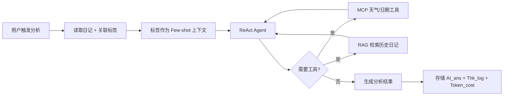

# 设计文档：夜记管理系统

## 概述

本系统是一个支持多用户的 Web 日记平台，核心功能为 AI 日记分析系统。每个用户拥有独立账户，日记数据严格隔离。系统通过 JWT 认证保护所有接口，前端使用 Vue 3 + TypeScript + Tailwind CSS，后端使用 Python + FastAPI，数据库使用 MySQL，AI 分析通过 LangChain 集成 LLM（ReAct Agent 模式）。

---

## 架构

```mermaid
graph TB
    subgraph 前端 Vue3
        A[登录/注册页] --> B[认证状态管理 AuthStore]
        B --> C[路由守卫 Router Guard]
        C --> D[日记页面]
        C --> E[标签管理页面]
        C --> F[模型管理页面]
        C --> G[个人中心页面]
        D --> H[日记编辑器]
        D --> I[日记列表]
        D --> J[AI 分析面板]
    end

    subgraph 后端 FastAPI
        K[认证路由 /auth] --> L[用户服务 UserService]
        M[日记路由 /diary] --> N[日记服务 DiaryService]
        M --> O[AI 分析服务 AIService]
        P[标签路由 /tags] --> Q[标签服务 TagService]
        R[模型路由 /models] --> S[模型服务 ModelService]
        L --> T[(MySQL 数据库)]
        N --> T
        Q --> T
        S --> T
        O --> U[LangChain ReAct Agent]
        U --> V[LLM 提供商]
        U --> W[MCP 天气服务]
    end

    前端 Vue3 -->|HTTP + JWT| 后端 FastAPI
```

---

## 组件与接口

### 后端组件

#### 认证模块（Auth Module）

- `POST /auth/register` — 用户注册，接收用户名/邮箱/密码，返回用户信息
- `POST /auth/login` — 用户登录，返回 JWT access_token
- `GET /auth/me` — 获取当前用户信息（需认证）
- `PUT /auth/me` — 修改个人信息（需认证，修改邮箱需验证码）
- `DELETE /auth/me` — 注销账号（需认证）
- `POST /auth/logout` — 退出登录，后端更新 last_time

#### 日记模块（Diary Module）

所有接口均需携带 `Authorization: Bearer <token>` 请求头。

- `POST /diary/entries` — 创建日记条目（含标签关联）
- `GET /diary/entries` — 获取当前用户日记列表（分页，按时间倒序，支持标签筛选）
- `GET /diary/entries/{nid}` — 获取单篇日记（仅限本人）
- `PUT /diary/entries/{nid}` — 修改日记正文及标签
- `DELETE /diary/entries/{nid}` — 删除日记（级联删除分析记录，更新标签引用计数）

#### 分析模块（Analysis Module）

- `POST /analysis` — 新增分析（提供 NID，调用 ReAct Agent）
- `GET /analysis/{nid}` — 获取日记的分析结果
- `PUT /analysis/{nid}` — 修改分析（智能防重：内容无变化则拒绝）
- `DELETE /analysis/{thk_id}` — 删除分析日志

#### 标签模块（Tag Module）

- `GET /tags` — 获取标签列表（按 UsageCount 排序）
- `POST /tags` — 新增自定义标签（用户）或系统标签（管理员）
- `PUT /tags/{tid}` — 修改标签属性（名称、颜色）
- `DELETE /tags/{tid}` — 删除标签

#### 模型模块（Model Module）

- `POST /models` — 注册模型（提供 base_url、model_key、model_name）
- `GET /models` — 获取当前用户的模型列表
- `PUT /models/{mod_id}` — 修改模型信息
- `DELETE /models/{mod_id}` — 删除模型

#### JWT 中间件（Auth Dependency）

FastAPI 依赖注入方式实现，所有受保护路由通过 `get_current_user` 依赖获取当前用户。

### 前端组件

- `AuthStore` — 全局认证状态（Pinia，token、用户信息、登录/登出方法）
- `RouterGuard` — 路由守卫，未登录时重定向到登录页
- `LoginPage` / `RegisterPage` — 登录/注册表单页面
- `ProfilePage` — 个人中心（修改信息、注销账号）
- `DiaryPage` — 日记主页面，包含编辑器、列表、AI 分析
- `DiaryEditor` — 日记编辑器组件（正文 + 标签选择）
- `DiaryList` — 日记列表组件（按时间倒序，支持标签筛选）
- `AIAnalysisPanel` — AI 分析结果展示组件
- `TagManager` — 标签管理页面
- `ModelManager` — 模型管理页面

---

## 数据模型

### users 表

```sql
CREATE TABLE users (
    uid           INT PRIMARY KEY AUTO_INCREMENT,
    user_name     VARCHAR(50)  NOT NULL UNIQUE,
    email         VARCHAR(100) NOT NULL UNIQUE,
    password_hash VARCHAR(255) NOT NULL,
    gender        VARCHAR(10),
    age           INT,
    phone         VARCHAR(20),
    address       VARCHAR(255),
    role          VARCHAR(20)  NOT NULL DEFAULT 'user',  -- 'user' | 'admin'
    create_time   DATETIME DEFAULT CURRENT_TIMESTAMP,
    last_time     DATETIME DEFAULT CURRENT_TIMESTAMP
);
```

### diary 表

```sql
CREATE TABLE diary (
    nid         INT PRIMARY KEY AUTO_INCREMENT,
    uid         INT NOT NULL,
    content     TEXT NOT NULL,
    is_open     BOOLEAN NOT NULL DEFAULT FALSE,
    date        DATE NOT NULL,
    weather     VARCHAR(100),
    ai_ans      TEXT,
    create_time DATETIME DEFAULT CURRENT_TIMESTAMP,
    update_time DATETIME DEFAULT CURRENT_TIMESTAMP ON UPDATE CURRENT_TIMESTAMP,
    FOREIGN KEY (uid) REFERENCES users(uid) ON DELETE CASCADE
);
CREATE INDEX idx_uid_date ON diary (uid, date);
```

### analysis 表

```sql
CREATE TABLE analysis (
    thk_id       INT PRIMARY KEY AUTO_INCREMENT,
    nid          INT NOT NULL UNIQUE,
    thk_time     DATETIME DEFAULT CURRENT_TIMESTAMP,
    token_cost   INT,
    thk_log      TEXT,
    diary_length INT,
    FOREIGN KEY (nid) REFERENCES diary(nid) ON DELETE CASCADE
);
```

### tags 表

```sql
CREATE TABLE tags (
    tid         INT PRIMARY KEY AUTO_INCREMENT,
    tag_name    VARCHAR(15) NOT NULL UNIQUE,
    color       VARCHAR(20),
    creator     VARCHAR(20) NOT NULL DEFAULT 'system',  -- 'system' | uid
    usage_cnt   INT NOT NULL DEFAULT 0,
    create_time DATETIME DEFAULT CURRENT_TIMESTAMP
);
```

### diary_tags 关联表（M:N）

```sql
CREATE TABLE diary_tags (
    nid INT NOT NULL,
    tid INT NOT NULL,
    PRIMARY KEY (nid, tid),
    FOREIGN KEY (nid) REFERENCES diary(nid) ON DELETE CASCADE,
    FOREIGN KEY (tid) REFERENCES tags(tid) ON DELETE CASCADE
);
```

### model_provider 表

```sql
CREATE TABLE model_provider (
    mod_id      INT PRIMARY KEY AUTO_INCREMENT,
    uid         INT NOT NULL,
    model_name  VARCHAR(100) NOT NULL DEFAULT '未命名',
    model_key   VARCHAR(500) NOT NULL,  -- 加密存储
    base_url    VARCHAR(255) NOT NULL,
    is_active   BOOLEAN NOT NULL DEFAULT TRUE,
    create_time DATETIME DEFAULT CURRENT_TIMESTAMP,
    FOREIGN KEY (uid) REFERENCES users(uid) ON DELETE CASCADE
);
```

### Python 数据模型（Pydantic）

```python
# 用户相关
class UserCreate(BaseModel):
    user_name: str
    email: str
    password: str

class UserUpdate(BaseModel):
    user_name: Optional[str] = None
    email: Optional[str] = None
    gender: Optional[str] = None
    age: Optional[int] = None
    phone: Optional[str] = None
    address: Optional[str] = None

class UserResponse(BaseModel):
    uid: int
    user_name: str
    email: str
    role: str
    create_time: datetime
    last_time: datetime

class TokenResponse(BaseModel):
    access_token: str
    token_type: str = "bearer"

# 日记相关
class DiaryCreate(BaseModel):
    content: str
    is_open: bool = False
    tag_ids: List[int] = []

class DiaryUpdate(BaseModel):
    content: Optional[str] = None
    is_open: Optional[bool] = None
    tag_ids: Optional[List[int]] = None

class DiaryResponse(BaseModel):
    nid: int
    uid: int
    content: str
    is_open: bool
    date: date
    weather: Optional[str]
    ai_ans: Optional[str]
    tags: List[TagResponse]
    create_time: datetime

# 标签相关
class TagCreate(BaseModel):
    tag_name: str  # max 15 chars
    color: Optional[str] = None

class TagResponse(BaseModel):
    tid: int
    tag_name: str
    color: Optional[str]
    creator: str
    usage_cnt: int

# 模型相关
class ModelCreate(BaseModel):
    model_name: str = "未命名"
    model_key: str
    base_url: str

class ModelResponse(BaseModel):
    mod_id: int
    model_name: str
    base_url: str
    is_active: bool
    create_time: datetime
    # model_key 不返回给前端

# 分析相关
class AnalysisResponse(BaseModel):
    thk_id: int
    nid: int
    thk_time: datetime
    token_cost: Optional[int]
    thk_log: Optional[str]
    diary_length: Optional[int]
```

### JWT Payload 结构

```json
{
  "sub": "uid",
  "user_name": "string",
  "role": "user|admin",
  "exp": "timestamp"
}
```

---

## AI 分析模块设计（ReAct Agent）



Agent 技术栈：
- **RAG**：检索用户历史日记作为上下文
- **MCP**：调用天气/日期服务
- **Function Calling**：工具调用
- **Prompt 工程**：标签 Few-shot 输入
- **上下文记忆**：维护对话历史

---

## 正确性属性

### 属性 1：用户注册唯一性

对于任意用户名或邮箱，若已存在于数据库中，则使用相同用户名/邮箱的注册请求应被拒绝，返回错误响应，且数据库中用户数量不变。

**Validates: Requirements 2.1, 2.2**

---

### 属性 2：JWT 认证保护

对于任意受保护的 API 接口，在不携带 token 或携带无效/过期 token 的情况下，系统应返回 401 Unauthorized。

**Validates: Requirements 2.5, 2.6**

---

### 属性 3：用户数据隔离

对于任意两个不同用户 A 和 B，用户 A 的日记查询接口只应返回属于用户 A 的日记条目，且用户 A 无法通过任何接口访问用户 B 的日记条目（应返回 403 或 404）。

**Validates: Requirements 4.1, 4.2**

---

### 属性 4：日记内容非空校验

对于任意仅由空白字符组成的字符串，提交为日记内容时，系统应拒绝保存并返回验证错误，日记数量不变。

**Validates: Requirements 3.2**

---

### 属性 5：日记创建与存储一致性

对于任意有效的日记内容，创建日记后，通过查询接口应能取回完全相同的内容，且该条目关联到创建者的 uid。

**Validates: Requirements 3.1**

---

### 属性 6：日记列表时间倒序

对于任意用户的日记列表，返回结果中所有条目的 `create_time` 字段应满足前一条的时间 >= 后一条的时间（严格按时间倒序排列）。

**Validates: Requirements 4.3**

---

### 属性 7：AI 分析用户隔离

对于任意用户触发 AI 分析时，Agent 读取的日记数据应仅包含该用户的日记条目，不包含其他任何用户的数据。

**Validates: Requirements 7.2**

---

### 属性 8：标签字数限制

对于任意超过 15 个字的标签名称，系统应拒绝创建并返回验证错误。

**Validates: Requirements 5.2**

---

### 属性 9：标签引用计数一致性

对于任意日记关联或取消关联标签的操作，标签的 UsageCount 应与实际关联该标签的日记数量保持一致。

**Validates: Requirements 5.6**

---

### 属性 10：分析防重机制

对于任意日记，若内容自上次分析后未发生变化，则修改分析的请求应被拒绝，不消耗 Token。

**Validates: Requirements 7.4**

---

## 错误处理

| 场景 | HTTP 状态码 | 响应格式 |
|------|------------|---------|
| 用户名/邮箱已存在 | 400 | `{"detail": "用户名或邮箱已存在"}` |
| 用户名或密码错误 | 401 | `{"detail": "用户名或密码错误"}` |
| 未携带 token | 401 | `{"detail": "未提供认证凭据"}` |
| token 无效或过期 | 401 | `{"detail": "认证凭据无效或已过期"}` |
| 访问他人日记 | 403 | `{"detail": "无权访问该资源"}` |
| 日记内容为空 | 422 | FastAPI 标准验证错误 |
| 标签名超过 15 字 | 422 | FastAPI 标准验证错误 |
| 日记内容未变化（防重） | 400 | `{"detail": "日记内容未变化，无需重新分析"}` |
| LLM 服务不可用 | 503 | `{"detail": "AI 服务暂时不可用，请稍后重试"}` |
| 数据库连接失败 | 500 | `{"detail": "服务器内部错误"}` |

---

## 测试策略

### 双重测试方法

- **单元测试**：验证具体示例、边界条件和错误处理
- **属性测试**：验证跨所有输入的通用属性（使用 `hypothesis` 库）

### 属性测试配置

- 使用 `hypothesis` 库（Python 属性测试框架）
- 每个属性测试最少运行 100 次迭代
- 标注格式：`# Feature: personal-website-diary, Property N: <属性描述>`

### 属性测试重点

| 属性 | 测试描述 |
|------|---------|
| 属性 1 | 生成随机用户名/邮箱，注册后再次注册同名应失败 |
| 属性 2 | 生成随机受保护接口请求，无效 token 应返回 401 |
| 属性 3 | 生成多个随机用户和日记，验证查询结果严格隔离 |
| 属性 4 | 生成随机空白字符串，提交日记应被拒绝 |
| 属性 5 | 生成随机日记内容，创建后查询应返回相同内容 |
| 属性 6 | 生成随机数量日记，列表应按时间倒序排列 |
| 属性 7 | 生成多用户日记数据，AI 分析只读取当前用户数据 |
| 属性 8 | 生成超过 15 字的标签名，应被拒绝 |
| 属性 9 | 随机关联/取消关联标签，验证 UsageCount 与实际数量一致 |
| 属性 10 | 内容未变化时触发修改分析，应被拒绝 |

### 前端测试

- 使用 `Vitest` + `Vue Test Utils`
- 测试认证状态管理（AuthStore）
- 测试路由守卫（未登录重定向）
- 测试日记编辑器的表单验证
